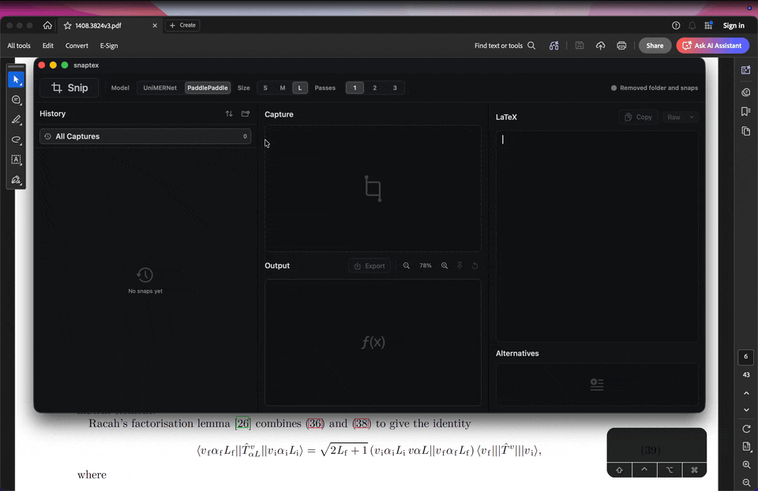

<p align="center">
  
</p>

<h1 align="center">SnapTex</h1>

<p align="center">
  Native macOS LaTeX OCR for turning equation screenshots into clean, editable LaTeX.
</p>

<p align="center">
  
  
  
  
</p>

## Overview

SnapTex is a local macOS app for capturing equations from your screen and converting them into LaTeX. It pairs a native SwiftUI interface with local Python OCR workers, rendered previews, copy-ready output, and history.

## Core Features

- Capture an equation region with the Snip button or global shortcut.
- Edit, preview, copy, and format the recognized LaTeX.
- Export the rendered formula as PNG or EPS.
- Keep recent snapshots in a persistent history.
- Manage local OCR models from inside the app.



## Models

SnapTex supports local formula recognition with:

- [UniMERNet](https://github.com/opendatalab/UniMERNet): [tiny](https://huggingface.co/wanderkid/unimernet_tiny), [small](https://huggingface.co/wanderkid/unimernet_small), and [base](https://huggingface.co/wanderkid/unimernet_base).
- [PaddleOCR](https://github.com/PaddlePaddle/PaddleOCR): [S](https://huggingface.co/PaddlePaddle/PP-FormulaNet_plus-S), [M](https://huggingface.co/PaddlePaddle/PP-FormulaNet_plus-M), and [L](https://huggingface.co/PaddlePaddle/PP-FormulaNet_plus-L).

## Install

SnapTex currently builds from source and uses a local Conda environment for the OCR workers.

Requirements:

- macOS 13 or later.
- Git.
- Xcode Command Line Tools.
- Miniforge, Miniconda, Anaconda, or another `conda` installation.

1. Install Apple's command line tools if they are not already installed:

   ```bash
   xcode-select --install
   ```

2. Make sure `conda` is available. For example, with Miniforge installed in your home directory:

   ```bash
   ~/miniforge3/bin/conda --version
   ```

   If that command is not found, install Miniforge, Miniconda, or Anaconda first. If your Conda binary is somewhere custom, use the
   `CONDA_EXE=/path/to/conda` prefix with the setup command in step 4.

3. Clone the repository and enter it:

   ```bash
   git clone https://github.com/nepeivodaRS/snaptex.git
   cd snaptex
   ```

4. Create the OCR environment and download the default model:

   ```bash
   ./scripts/setup_snaptex_env.sh
   ```

   This creates a Conda environment named `snaptex`, installs the Python OCR dependencies, clones the UniMERNet runtime, and downloads the default UniMERNet model under:

   ```text
   ~/Library/Application Support/snaptex/UniMERNet
   ```

   To choose a different default UniMERNet model size during setup:

   ```bash
   SNAPTEX_MODEL_SIZE=tiny ./scripts/setup_snaptex_env.sh
   ```

   Supported setup values are `tiny`, `small`, and `base`; the aliases `s`, `m`, and `l` are also accepted. The app can also
   download and manage additional UniMERNet and PaddleOCR models after the environment is installed.

5. Build, install, and launch SnapTex:

   ```bash
   ./scripts/build_and_run.sh
   ```

   The script builds the Swift app, creates an app bundle, installs it at `/Applications/snaptex.app`, verifies the code signature, and opens the app.

6. If you do not have a local signing identity yet, use an ad-hoc development build:

   ```bash
   SNAPTEX_ALLOW_ADHOC_SIGNING=1 ./scripts/build_and_run.sh
   ```

   Ad-hoc signing is useful for local testing, but macOS may ask you to re-grant permissions after rebuilds.

7. On first use, grant any macOS permissions SnapTex requests, such as Screen Recording for capturing equation regions. If permission changes, quit and reopen SnapTex.

The installed app is:

```text
/Applications/snaptex.app
```

To verify that the installed app launches:

```bash
./scripts/build_and_run.sh --verify
```

## Development

```bash
swift test
python -m pytest python/tests
```

## Credits

SnapTex uses [UniMERNet](https://github.com/opendatalab/UniMERNet), [PaddleOCR](https://github.com/PaddlePaddle/PaddleOCR), and [MathJax](https://www.mathjax.org/).

Third-party code and models retain their own licenses.

## License

SnapTex is released under the [MIT License](LICENSE).
